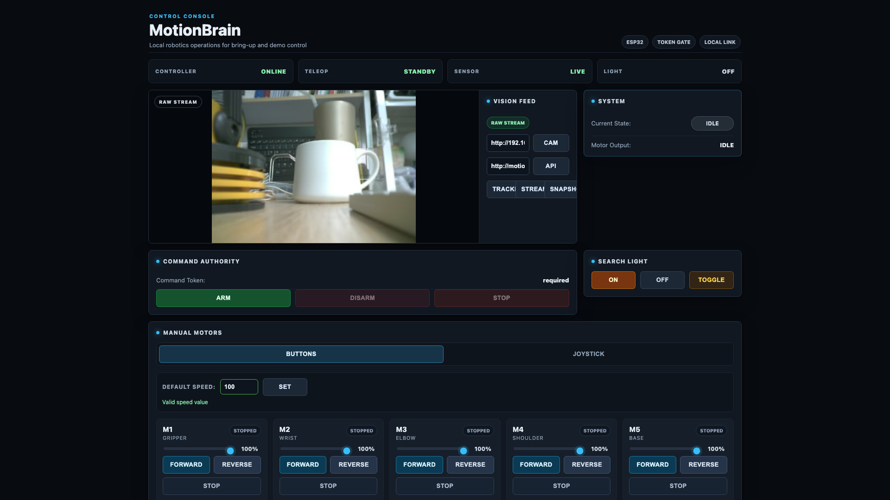
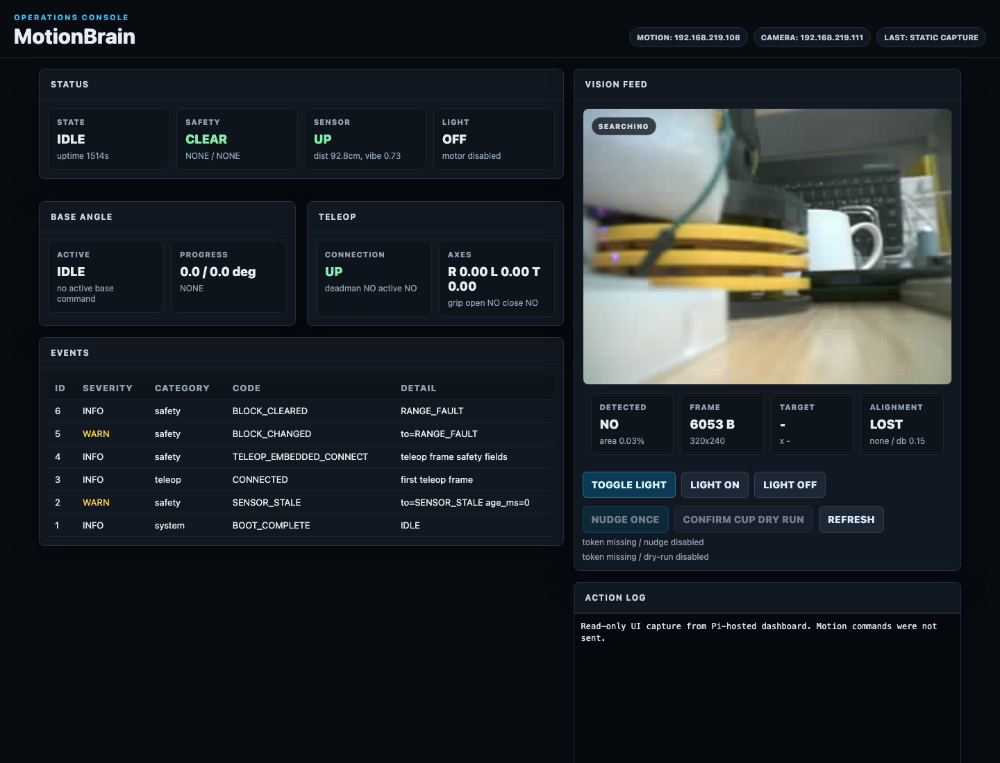
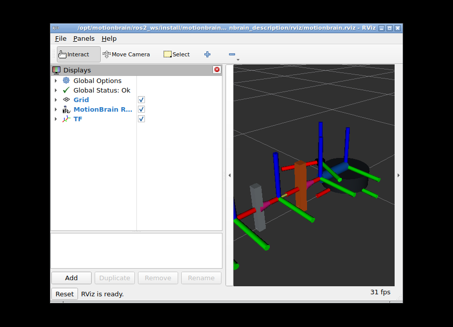

# MotionBrain 포트폴리오 요약

[README](README.md) | [영어 README](README.en.md) | [영어 포트폴리오 요약](PORTFOLIO.en.md)

## 개요

MotionBrain은 ESP32 모션 제어기, STM32 센서/텔레오퍼레이션 계층, ESP32-CAM 비전 입력, Raspberry Pi + ROS2 호스트 브리지를 하나의 로봇팔 시스템으로 통합한 임베디드 로보틱스 시스템 프로젝트다.

프로젝트의 핵심은 “모터를 움직였다”가 아니라, 실제 하드웨어에서 안전 상태, 명령 경계, 센서 피드백, 비전 입력, ROS2 토픽, 호스트 측 판단을 분리된 계층으로 설계하고 검증했다는 점이다.

물리 텔레오퍼레이션 데모 미디어 스냅샷은 `demo-ready-20260608` 태그로 고정했다.

## 서류 검토용 핵심 신호

- 실물 하드웨어 기반: ESP32 모션 제어기, STM32 유선 텔레오퍼레이션,
  ESP32-CAM, Raspberry Pi를 실제 네트워크와 전원 환경에서 통합했다.
- 안전 경계 중심: 모든 상태 변경과 물리 출력은 토큰, 상태 머신,
  `SafetyGate`, deadman, freshness timeout을 통과해야 한다.
- ROS2 시스템 역량: typed messages, ROS2 bridge, C++ control guard,
  mission supervisor, URDF/RViz, `ros2_control` dry-run mock/open-loop
  `SystemInterface`, M4 read-only measured state mode를 갖췄고,
  `ros2_control`을 통한 물리 출력은 열지 않았다.
- 운영 가능성: Pi systemd 서비스, SSH/DNS 복구 절차, health check,
  runtime evidence, `ros2_control` evidence, CI 검증까지 문서화했다.
- 주장 경계: M4 어깨 한 축의 제한 폐루프 검증과 로봇팔 전체의 위치 제어를
  구분하고, 임의 객체 인식이나 자율 집기를 과장하지 않는다.

## 빠른 증거 링크

- [Claim-to-evidence matrix 초안](docs/evidence/claim-to-evidence-matrix.md):
  주장, 증거, 한계, 주장하지 않는 항목을 한눈에 보는 검토용 guardrail
- [물리 텔레오퍼레이션 GIF](https://raw.githubusercontent.com/ParkJsoo/motionbrain/demo-ready-20260608/docs/assets/demo/motionbrain-demo.gif)
  / [MP4](https://raw.githubusercontent.com/ParkJsoo/motionbrain/demo-ready-20260608/docs/assets/demo/motionbrain-demo.mp4)
- [`ros2_control` dry-run 검증](docs/evidence/2026-06-16-ros2-control-open-loop.md):
  controller manager, hardware-interface plugin, command/state interface,
  `FollowJointTrajectory`, `/joint_states` dry-run state mirror
- [Pi/systemd/ROS2 health 검증](docs/evidence/2026-06-16-pi-system-health.md):
  dashboard, perception, ROS2 bridge service와 typed topic/service/action 상태
- [Pi runtime 측정](docs/evidence/2026-06-17-runtime-measurements.md):
  HTTP endpoints `200`, 15초 bounded ROS2 topic acquisition,
  `/joint_states` 약 4.9-5.0 Hz 확인, read-only/no actuation capture
- [M4 어깨 폐루프 검증](docs/evidence/2026-06-28-m4-shoulder-closed-loop.md):
  AS5600 절대각 I2C 피드백, 센서 고장 차단, 230-245° 검증 범위의 제한 목표각 수렴

## 문제 정의

저가형 5축 DC 모터 로봇팔은 기본적으로 엔코더, 힘 센서, 신뢰할 수 있는
전체 관절 절대 위치가 부족하다. 2026-06-28에 M4 어깨 한 축은 AS5600
절대각 피드백과 좁은 범위의 폐루프 목표각 제어를 검증했지만, 이를 전체
로봇팔 위치 제어나 완전 자율 집기로 확대해서 주장하지 않는다.

그래서 MotionBrain은 다음 기준으로 설계했다.

- 저수준 모터 출력은 ESP32 안전 게이트 뒤에 둔다.
- 센서와 텔레오퍼레이션 입력은 STM32에서 구조화된 UART 프레임으로 보낸다.
- 시리얼, HTTP, 대시보드, ROS2 입력은 같은 명령 의미를 공유한다.
- 비전과 AI는 Raspberry Pi 쪽에서 실행하되, 물리 동작은 작업자 확인과 안전 상태를 통과해야 한다.
- 검증되지 않은 호스트 계층이 직접 모터를 우회 제어하지 않게 한다.

## 담당 구현

- ESP32 5축 DC 모터 제어 펌웨어
- `BOOT -> IDLE -> ARMED -> FAULT` 안전 상태 머신
- 시리얼/HTTP 공통 명령 처리 구조
- 토큰 기반 HTTP 상태 변경 명령
- STM32 `MPU-6050 + UART` 센서/텔레오퍼레이션 펌웨어와 HC-SR04 bench 검증 경로
- 데드맨, 프레임 최신성 타임아웃, 센서 고장 래치
- M4 어깨 AS5600 I2C 절대각 피드백, 제한 폐루프 목표각 제어와 HTTP/대시보드/ROS2 상태 노출
- ESP32-CAM `/capture` 중심 펌웨어와 `/stream` 비활성화 안정화
- Raspberry Pi 대시보드와 인식 서비스
- OpenCV 기반 빨간 타겟 검출과 타겟 오버레이
- 안전 게이트 기반 bounded base nudge 제어 표면
- ROS2 Jazzy 브리지, 타입 지정 메시지, C++ 제어 guard, mission supervisor
- `ros2_control` dry-run mock 데모와 안전한 open-loop `SystemInterface` 스캐폴드
- Raspberry Pi systemd 배포와 상태 점검
- GitHub Actions 기반 PlatformIO/Python/ROS2 품질 게이트

## 운영 화면

최종 물리 텔레오퍼레이션 영상은 README 상단 GIF/MP4로 공개했다. 아래 이미지는 영상과 별도로 캡처한 운영 UI/RViz 정적 증거로, MotionBrain이 단순 펌웨어 코드가 아니라 작업자 화면, 관찰 화면, ROS2 시각화까지 갖춘 시스템이라는 점을 보여준다.



ESP32 내장 제어 콘솔은 direct capture / Pi tracked frame 기반 카메라 확인, 토큰 기반 상태 변경 명령, 수동 모터/조인트 제어, 현재 시스템 상태를 한 화면에서 제공한다.



Pi 대시보드는 상태, 안전, 텔레오퍼레이션, 이벤트, 카메라 프레임, 감지/정렬 결과를 관찰하는 운영 화면이다. 물리 동작 버튼은 토큰과 안전 상태를 다시 확인하는 제한된 경로로만 쓰인다.



RViz 화면은 Pi dashboard mirror가 게시한 live ROS2 topic, `RobotModel`, TF를 한 화면에서 확인하는 시각화 경로다.

## 시스템 구조

```text
STM32 센서 / 텔레오퍼레이션
  -> UART 센서와 조작 프레임
  -> ESP32 모션 제어기
  -> Dispatcher + SafetyGate
  -> RobotArm / MotionSequence
  -> TB6612FNG 모터 드라이버
  -> 5축 DC 모터 로봇팔

ESP32-CAM
  -> HTTP 캡처
  -> direct 스트림은 HTTP 410으로 비활성화
  -> Raspberry Pi 인식 서비스
  -> 대시보드 타겟 오버레이
  -> ROS2 /camera/detection(_typed)

Raspberry Pi ROS2 호스트
  -> motionbrain_msgs
  -> motionbrain_ros_bridge
  -> motionbrain_control C++ guard
  -> motionbrain_mission supervisor
  -> 타입 지정 상태, 감지, 기구학, guard, mission 토픽
```

## 핵심 기술 포인트

### 안전 중심 제어

모션 명령은 시스템 상태, 고장 래치, 센서 상태, 토큰 검증을 통과해야 실행된다. 수동 웹 조작은 제어기 쪽 lease를 적용해 갱신이 끊기면 즉시 hard stop으로 떨어지게 했다.

### 멀티 MCU 역할 분리

ESP32는 모터 출력과 안전 상태를 담당하고, STM32는 센서/텔레오퍼레이션 프레임을 담당한다. 이 분리는 센서 입력, 수동 조작, 호스트 명령이 같은 ESP32 안전 경계를 통과하게 만든다.

### 비전과 로봇 동작의 분리

ESP32-CAM은 카메라 노드로만 두고, Raspberry Pi에서 감지와 오버레이를 처리한다. 대시보드와 ROS2 브리지는 같은 선택 타겟 payload를 소비한다.

### ROS2 호스트 경계

ROS2는 ESP32 내부 제어를 대체하지 않는다. 대신 `/status`, `/events`, `/camera/detection`을 타입 지정 토픽으로 승격하고, C++ 제어 guard와 mission supervisor가 현재 상태와 타겟 정렬을 판단한다. `ros2_control`은 dry-run mock controller, open-loop `SystemInterface` 스캐폴드, M4 read-only measured state mode까지 제공하며, 물리 출력은 여전히 ESP32 firmware safety 경계 뒤에 둔다.

### 검증 가능한 데모 경계

현재 공개 데모는 실물 텔레오퍼레이션이다. 보조 검증 증거로는 direct capture / Pi tracked frame 기반 카메라 확인, Pi 호스트 대시보드, 빨간 타겟/known-object 타겟 오버레이, ROS2 타입 지정 토픽, 안전 게이트 기반 bounded nudge 제어 표면, 토큰 기반 search-light on/off 명령 경로가 있다. 자동 집기는 아직 활성화하지 않는다.

## 검증 결과

- ESP32 제어기와 ESP32-CAM PlatformIO 빌드 통과
- `TB6612FNG x3`와 `M1~M5` 실제 모터 출력 확인
- M4 어깨 AS5600 I2C 각도/자석 상태 확인, 제한 범위 폐루프 목표
  초기 검증 238.10°/233.96°와 재장착 회귀 238.09°/234.14°로 안정화
- 텔레오퍼레이션 어깨 입력이 활성 목표를 53ms 만에 `OVERRIDDEN`으로
  취소하는 것을 확인하고, 직접/sequence/teleop M4 경로에 공통 소프트
  리밋 가드를 적용
- M4 보정각, raw 각도, 자석 상태, 센서 최신성, 제어/가드 상태를 ESP32
  `/status`, Pi 대시보드, ROS2 typed status와 diagnostics에 연결
- 고정 장착 상태에서 232-243° 및 75/100% 조합 5회와 238↔234° 반복
  6회를 두 차례 실행해 총 22/22 통과. 두 번째 전체 매트릭스의 평균
  절대오차는 0.191°, 최대 절대오차는 0.31°였고, 안정화 후 오차 재검사와
  `TARGET_MISSED` 실패 상태를 적용
- 23.1g 하중의 첫 단거리 상승 실패에서 PWM 램프와 보정 펄스의 불일치를
  확인하고 상승 보정 최대 시간을 500ms로 수정. AS5600 한 스텝 변동을 위한
  내부 성공 여유 `±0.40°`도 분리해 적용한 뒤 무부하 11/11(평균 0.132°,
  최대 0.36°), 23.1g 11/11(평균 0.155°, 최대 0.31°) 통과
- STM32 `MPU-6050 + UART` 텔레오퍼레이션과 HC-SR04 bench 경로 검증
- 유선 텔레오퍼레이션 데드맨 입력으로 실제 모터 출력 및 release 정지 확인
- 최종 물리 텔레오퍼레이션 데모 영상 캡처와 README GIF/MP4 반영
- ESP32-CAM `/status`, `/capture` 확인과 `/stream` HTTP 410 비활성화 검증
- 로컬 LAN에서 ESP32 제어기, ESP32-CAM, Raspberry Pi 동시 연결 확인
- `MotionBrain Control` 웹 UI에서 토큰 입력 후 상태 변경 명령 확인
- Pi 대시보드에서 카메라 feed, 빨간 타겟 박스, 안전 게이트 기반 bounded nudge 제어 표면 확인
- Pi 인식 서비스에서 YOLOv5s/OpenCV DNN 기반 제한 `cup` 타겟 경로 확인. 최신 안정 CAM 서비스 프로필은 ESP32-CAM `qvga` / JPEG quality `15`다.
- Raspberry Pi 4 + Ubuntu 24.04 + ROS2 Jazzy에서 `colcon build/test` 통과
- `/motionbrain/status_typed`, `/camera/detection_typed`, estimated/measured `/joint_states`, `/motionbrain/kinematics_typed`, `/motionbrain/control_guard_typed`, `/motionbrain/mission_state_typed` 상태 점검 통과
- Pi 인식 서비스 결과가 ROS2 `/camera/detection_typed`까지 전달되는 것 확인
- Docker/noVNC RViz 검증 환경에서 RobotModel/TF와 Pi dashboard mirror 기반 live ROS2 topic 시각화 확인
- `motionbrain_ros2_control_mock`과 `motionbrain_hardware_interface`로 `ros2_control` controller/hardware interface dry-run 경계와 M4 read-only measured state mode 검증
- GitHub Actions에서 PlatformIO, Python 테스트, ROS2 workspace 검증

## 객체 인식 현황

Pi에서 OpenCV DNN/ONNX 기반 constrained known-object detection 경로는 구현했다. `config/coco80.labels`와 명시적 모델 경로를 사용하고, 모델 weight는 repository에 넣지 않는다.

현재 물리 bench에서 가장 신뢰할 수 있는 known-object 경로는 YOLOv5s/OpenCV DNN, `--object-target cup`, 설정된 confidence gate 기준의 제한된 `cup` 확인이다. 이 경로는 Pi 대시보드/인식 API에서 `cup`을 반환한 증거가 있고, 최신 안정 CAM 서비스 프로필은 ESP32-CAM `qvga` / JPEG quality `15`다. 수동 카메라 확인은 direct `/capture`, 인식 확인은 Pi tracked frame으로 분리했다.

따라서 현재 문서와 데모에서는 다음처럼 표현한다.

- 가능: Pi 호스트 객체 인식 흐름, 선택 타겟 계약, ROS2/대시보드 연동, 제한된 `cup` 인식 확인
- 안정 검증 완료: 빨간 타겟 추적/오버레이, direct `/capture` 기반 수동 카메라 확인, cup 인식 확인
- 아직 미완료: 임의 물체 인식, 마커/물체 기반 자동 집기, 피드백 없는 연속 visual servoing

## 현재 한계

- M4 어깨 한 축만 기구적으로 고정된 AS5600 피드백을 사용한다. 나머지 네 축에는
  위치 피드백이 없고 전체 관절 절대 위치나 `ros2_control` 물리 폐루프는 없다.
- M4 GPIO0/GPIO15는 현재 핀 점유에서 유지하는 지원 배치지만 부트 스트랩
  조건을 준수해야 한다. 센서·자석 고정은 완료했고 ROS zero는 `222.80°`,
  sign `+1`로 적용했다. `230-245°`는 가장 강한 검증 범위이고,
  `122.08-301.02°`는 현재 자세 조건부 provisional soft range이므로 다른 자세,
  장착, 하중에서는 다시 검증해야 한다.
- `base_yaw_reference`가 설치되지 않아 physical guarded routine `run/execute`는
  비활성화되어 있다. ROS2 routine service/action은 status, dry-run, expected
  rejection 경계까지만 주장한다.
- HC-SR04는 최종 물리 데모에서 제거됐고, range telemetry는 disabled/nonblocking 상태로 처리한다.
- ESP32-CAM QVGA 입력은 일반 객체 인식에는 품질 한계가 있다.
- 일반 텍스트 명령으로 임의 물체를 찾아 집는 수준은 아직 아니다.
- README용 물리 텔레오퍼레이션 영상과 비동작 screenshot/evidence는 캡처됐다. 추가 search-light toggle 또는 bounded nudge evidence는 별도 목적이 있을 때만 새로 촬영한다.

## 다음 단계

1. `demo-ready-20260608` 물리 텔레오퍼레이션 데모 미디어와 README GIF/MP4를 기준 공개 링크로 유지
2. 설명 목적에 따라 embedded safety, multi-MCU teleop, Pi perception/dashboard, ROS2 bridge 중 강조점을 선택
3. 마커 또는 고정 known-object 기반 제한 집기 계획을 별도 설계
4. 더 좋은 카메라, 거리/접촉 센서, 검증된 edge runtime을 추가한 뒤 자율 동작 범위 재검토
5. 새 하드웨어 검증 없이 임의 객체 인식이나 자율 집기 범위를 확장하지 않기

## 관련 문서

- [README.md](README.md): 프로젝트 진입점
- [README.en.md](README.en.md): 영어 프로젝트 진입점
- [ROBOTICS_SYSTEM_READINESS.md](ROBOTICS_SYSTEM_READINESS.md): 로보틱스 시스템/ROS2 하드웨어 경계 요약
- [docs/evidence/claim-to-evidence-matrix.md](docs/evidence/claim-to-evidence-matrix.md): 주장과 증거, 한계, 미주장 항목 matrix
- [PIN_MAP.md](PIN_MAP.md): ESP32 핀 점유와 M4 AS5600 배치 정책
- [docs/evidence/2026-06-28-m4-shoulder-closed-loop.md](docs/evidence/2026-06-28-m4-shoulder-closed-loop.md): M4 어깨 단일축 폐루프 실물 검증
- [docs/evidence/2026-06-16-ros2-control-open-loop.md](docs/evidence/2026-06-16-ros2-control-open-loop.md): `ros2_control` dry-run 검증 요약
- [docs/evidence/2026-06-16-pi-system-health.md](docs/evidence/2026-06-16-pi-system-health.md): Pi/systemd/ROS2 health 검증 요약
- [docs/evidence/2026-06-17-runtime-measurements.md](docs/evidence/2026-06-17-runtime-measurements.md): Pi runtime/ROS2 측정 기록
