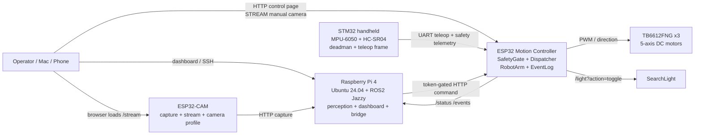
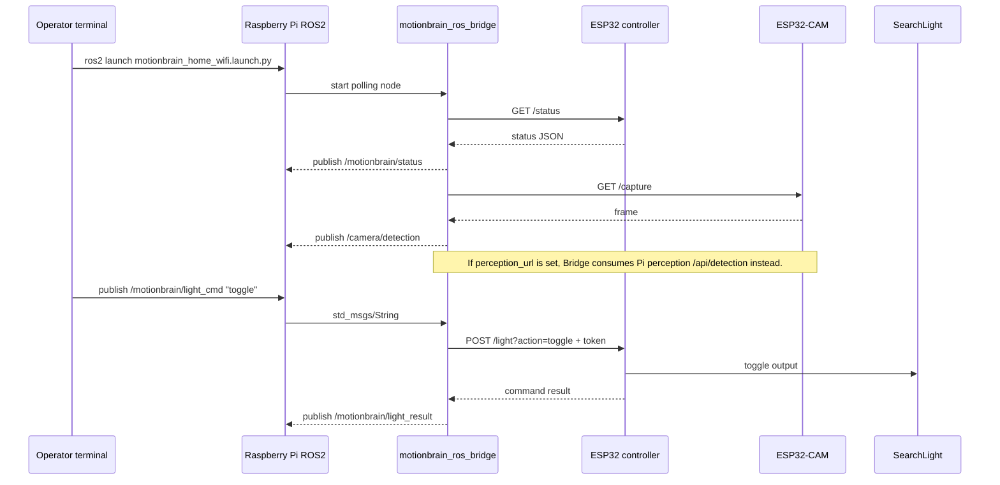
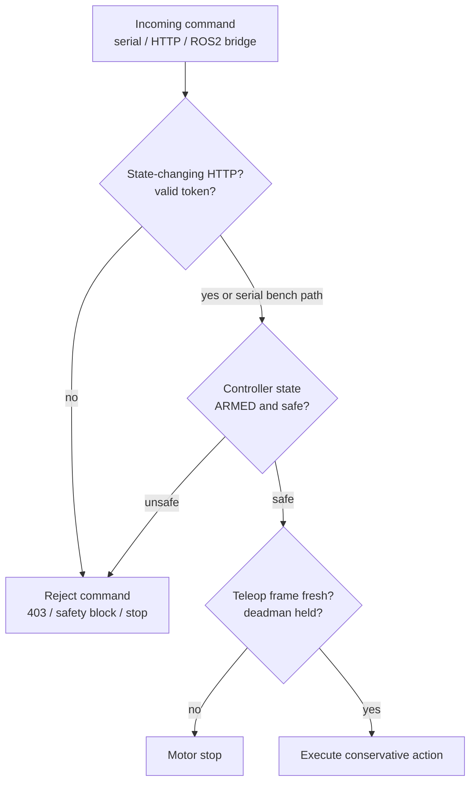

# MotionBrain Architecture Diagrams

[한국어](ARCHITECTURE_DIAGRAMS.md)

This document provides Mermaid diagrams for portfolio explanation and demo
capture. GitHub renders these diagrams directly in Markdown.

## Full System

## ROS2 Demo Path

## Safety And Authorization Boundary

## Portfolio Talking Points

- Raspberry Pi/ROS2 provides host-side orchestration while ESP32 keeps the
  motor and safety boundary.
- ROS2 commands do not bypass the ESP32 token gate or SafetyGate.
- ESP32-CAM raw stream is used for manual `STREAM` operation, while Pi
  perception is observed through `/camera/detection` and the embedded
  `TRACKED` confirmation view.
- Motion action remains a separate opt-in command from detection.
- STM32 handheld teleop constrains live motion through deadman and frame
  freshness checks.
