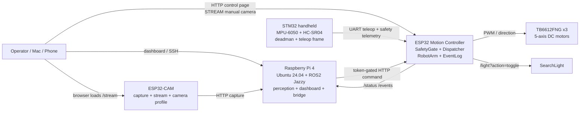
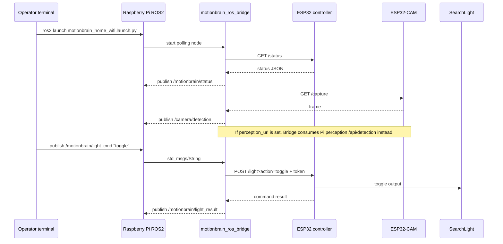
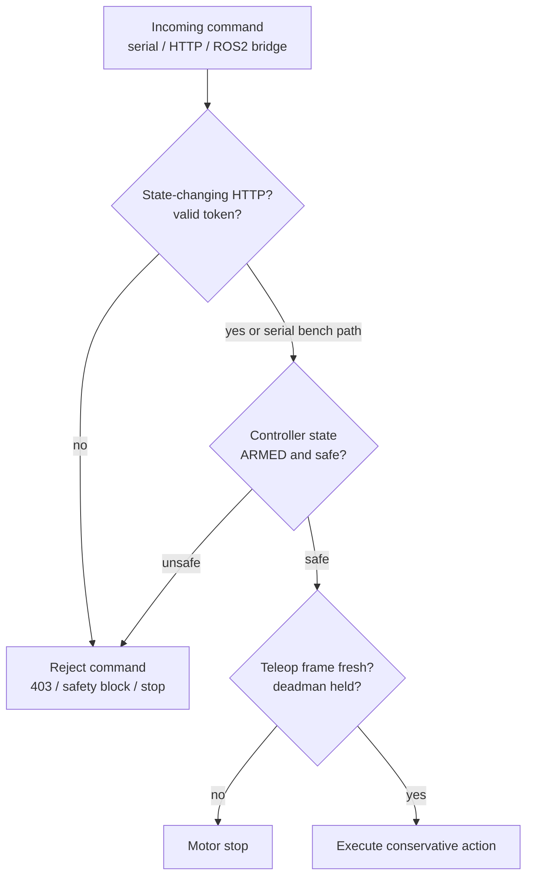

# MotionBrain 아키텍처 다이어그램

[English](ARCHITECTURE_DIAGRAMS.en.md)

이 문서는 포트폴리오 설명과 데모 캡처에 사용할 구조 다이어그램이다.
GitHub Markdown에서 Mermaid로 바로 렌더링된다.

## 전체 시스템

## ROS2 데모 경로

## 안전 / 권한 경계

## 포트폴리오에서 강조할 점

- Raspberry Pi/ROS2는 상위 orchestration 계층이고, ESP32가 motor/safety
  boundary를 계속 소유한다.
- ROS2 command도 ESP32 token gate와 SafetyGate를 우회하지 않는다.
- ESP32-CAM raw stream은 수동 조작용 `STREAM` 경로로 쓰고, Pi perception
  결과는 `/camera/detection`과 embedded `TRACKED` 확인 경로로 관측한다.
- Motion action은 detection과 분리된 별도 opt-in command다.
- STM32 handheld teleop는 deadman과 frame freshness를 통해 live motion을
  제한한다.
