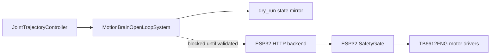

# 2026-06-16 ros2_control Open-Loop Evidence

[README](../../README.md) | [Portfolio](../../PORTFOLIO.en.md)

This note summarizes a Raspberry Pi 4 / ROS2 Jazzy run of the
`motionbrain_hardware_interface` package. It is public-facing evidence for the
ROS2 controller and hardware-interface boundary. It is not evidence of physical
actuation.

## Environment

| Item | Value |
| --- | --- |
| Host | Raspberry Pi 4, `motionbrain-pi` |
| OS/kernel | Ubuntu 24.04, Linux `6.8.0-1057-raspi`, `aarch64` |
| ROS distro | Jazzy |
| ROS domain | `ROS_DOMAIN_ID=43` |
| Workspace | `/home/motionbrain/develop/arduino/motionbrain/ros2_ws` |
| Physical actuation | Disabled |
| Hardware transport | `transport_mode=dry_run` |
| Capture time | `2026-06-16T20:52:45+09:00` |

## What Was Verified

- Required ROS2 runtime packages were present:
  `controller_manager`, `hardware_interface`, `joint_state_broadcaster`,
  `joint_trajectory_controller`, `ros2_control`, `ros2controlcli`, and
  `motionbrain_hardware_interface`.
- The hardware interface package resolved through `ros2 pkg prefix`.
- The installed URDF contained `<param name="transport_mode">dry_run</param>`.
- `ros2 launch motionbrain_hardware_interface hardware_interface.launch.py`
  loaded `MotionBrainOpenLoopSystem`.
- The hardware plugin initialized, configured, and activated successfully.
- `joint_state_broadcaster` and `motionbrain_arm_controller` reached `active`.
- Five position command interfaces were available and claimed:
  `base_yaw_joint`, `shoulder_pitch_joint`, `elbow_pitch_joint`,
  `wrist_pitch_joint`, and `gripper_joint`.
- Position and velocity state interfaces were exported for all five joints.
- A `control_msgs/action/FollowJointTrajectory` goal was accepted and finished
  with `SUCCEEDED`.
- `/joint_states` moved from all-zero positions to the commanded dry-run state:
  base yaw `0.2`, shoulder pitch `0.1`, elbow pitch `-0.1`, wrist pitch `0.05`,
  gripper `0.0`.

## Boundary Diagram



The solid path is the verified path. The dotted path is intentionally not
enabled in this repository state.

## Correct Claim

```text
MotionBrain has a safe open-loop ros2_control SystemInterface scaffold. It can
load under controller_manager, expose command/state interfaces, accept a
FollowJointTrajectory goal, and mirror accepted commands into /joint_states in
dry_run mode.
```

## Claims To Avoid

- Closed-loop joint control
- Vendor-specific actuator SDK integration
- Physical ros2_control actuation
- Encoder-verified trajectory tracking
- Full-platform motion control

## Reproduction Helper

```bash
cd ros2_ws
source /opt/ros/jazzy/setup.bash
colcon build --packages-select motionbrain_hardware_interface
source install/setup.bash
../tools/raspi/capture_ros2_control_hardware_evidence.sh
```
