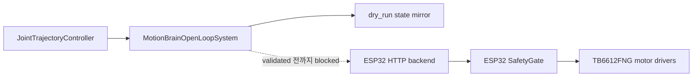

# 2026-06-16 ros2_control Open-Loop 증거

[README](../../README.md) | [PORTFOLIO](../../PORTFOLIO.md) | [English](2026-06-16-ros2-control-open-loop.en.md)

이 문서는 Raspberry Pi 4 / ROS2 Jazzy에서 `motionbrain_hardware_interface`
package를 실행한 결과를 요약한다. ROS2 controller와 hardware-interface 경계에
대한 공개 증거이며, 물리 구동 증거는 아니다.

## 환경

| 항목 | 값 |
| --- | --- |
| Host | Raspberry Pi 4, `motionbrain-pi` |
| OS/kernel | Ubuntu 24.04, Linux `6.8.0-1057-raspi`, `aarch64` |
| ROS distro | Jazzy |
| ROS domain | `ROS_DOMAIN_ID=43` |
| Workspace | `/home/motionbrain/develop/arduino/motionbrain/ros2_ws` |
| Physical actuation | Disabled |
| Hardware transport | `transport_mode=dry_run` |
| 캡처 시각 | `2026-06-16T20:52:45+09:00` |

## 검증한 내용

- 필요한 ROS2 runtime package가 설치되어 있었다:
  `controller_manager`, `hardware_interface`, `joint_state_broadcaster`,
  `joint_trajectory_controller`, `ros2_control`, `ros2controlcli`,
  `motionbrain_hardware_interface`.
- Hardware interface package가 `ros2 pkg prefix`로 resolve됐다.
- 설치된 URDF에 `<param name="transport_mode">dry_run</param>`이 들어 있었다.
- `ros2 launch motionbrain_hardware_interface hardware_interface.launch.py`가
  `MotionBrainOpenLoopSystem`을 load했다.
- Hardware plugin이 initialize/configure/activate에 성공했다.
- `joint_state_broadcaster`와 `motionbrain_arm_controller`가 `active` 상태가
  됐다.
- 다섯 개 position command interface가 available/claimed 상태였다:
  `base_yaw_joint`, `shoulder_pitch_joint`, `elbow_pitch_joint`,
  `wrist_pitch_joint`, `gripper_joint`.
- 다섯 joint 모두 position/velocity state interface를 export했다.
- `control_msgs/action/FollowJointTrajectory` goal이 accepted 상태가 되었고
  `SUCCEEDED`로 끝났다.
- `/joint_states`가 all-zero position에서 commanded dry-run state로 바뀌었다:
  base yaw `0.2`, shoulder pitch `0.1`, elbow pitch `-0.1`,
  wrist pitch `0.05`, gripper `0.0`.

## 경계 다이어그램



실선 경로가 검증된 경로다. 점선 경로는 이 repository 상태에서 의도적으로
활성화하지 않았다.

## 올바른 주장

```text
MotionBrain은 안전한 open-loop ros2_control SystemInterface scaffold를 갖고
있다. controller_manager에서 load되고, command/state interface를 노출하며,
FollowJointTrajectory goal을 받을 수 있고, dry_run mode에서 accepted command를
/joint_states에 mirror한다.
```

## 피해야 할 주장

- Closed-loop joint control
- Vendor-specific actuator SDK integration
- Physical ros2_control actuation
- Encoder-verified trajectory tracking
- Full-platform motion control

## 재현 helper

```bash
cd ros2_ws
source /opt/ros/jazzy/setup.bash
colcon build --packages-select motionbrain_hardware_interface
source install/setup.bash
../tools/raspi/capture_ros2_control_hardware_evidence.sh
```
